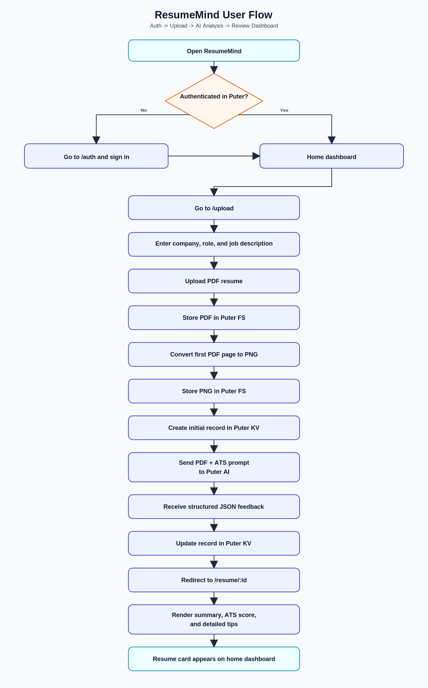

# ResumeMind

ResumeMind is an AI-powered resume reviewer that helps candidates improve resume quality before applying.
It analyzes a PDF resume against a target role and job description, then returns structured feedback with ATS scoring, category-level breakdowns, and actionable improvement tips.

## Why ResumeMind

Recruiters and ATS systems filter resumes quickly.
ResumeMind gives a fast pre-screen so candidates can:

- Understand likely ATS performance before applying
- Identify weak sections in tone, content, structure, and skills
- Track multiple resume submissions by company and role


## Core Features

- Puter-based authentication flow for secure user session handling
- PDF upload with drag-and-drop support
- First-page PDF to image conversion for visual preview
- AI-generated structured feedback in JSON format
- ATS score plus section-wise scoring:
	- Tone and Style
	- Content
	- Structure
	- Skills
- Historical resume list on the home page
- Detailed review page with summary, ATS insights, and expandable recommendations
- Data wipe route to clear uploaded files and key-value records

## User Flow Diagram

The following diagram shows the end-to-end ResumeMind workflow:




## Tech Stack

- React 19
- React Router 7 (framework mode)
- TypeScript
- Zustand (state management)
- Tailwind CSS v4
- React Dropzone
- pdfjs-dist (PDF rendering/conversion)
- Puter SDK (Auth, Filesystem, AI, KV)

## Architecture Notes

- App state and Puter service wrappers live in `app/lib/puter.ts`
- Resume analysis prompt and response schema are defined in `constants/index.ts`
- PDF conversion utility is implemented in `app/lib/pdf2img.ts`
- Route map is defined in `app/routes.ts`

## Routes

- `/` Home dashboard with previously analyzed resumes
- `/auth` Authentication page
- `/upload` Resume upload and analysis workflow
- `/resume/:id` Detailed feedback view for one resume
- `/wipe` Utility page to clear stored app data

## Local Development

### Prerequisites

- Node.js 20+
- npm
- Internet access (required to load Puter script)
- A Puter account for sign-in

### Install

```bash
npm install
```

### Run in Development

```bash
npm run dev
```

Open http://localhost:5173 in your browser.

### Type Check

```bash
npm run typecheck
```

### Production Build

```bash
npm run build
npm run start
```

## Deployment

### Vercel

This repo includes `vercel.json` configured with:

- Build command: `npm run build`
- Output directory: `build/client`
- SPA rewrite fallback to `index.html`

### Docker

```bash
docker build -t resumemind .
docker run -p 3000:3000 resumemind
```

## Feedback Schema (High Level)

The AI response is expected as JSON with this shape:

- `overallScore`
- `ATS` with score and tips
- `toneAndStyle` with score and detailed tips
- `content` with score and detailed tips
- `structure` with score and detailed tips
- `skills` with score and detailed tips

## Project Structure

```text
app/
	components/      UI building blocks (cards, gauges, accordions, sections)
	lib/             Puter wrappers, utilities, PDF conversion
	routes/          Route-level pages (home, auth, upload, resume, wipe)
constants/         Prompt templates and response format contract
public/            Static assets and PDF worker
types/             Shared TypeScript declarations
```

## Known Constraints

- AI analysis quality depends on the resume content and job description quality
- Current PDF preview conversion uses page 1 only
- The app depends on Puter APIs being available in the client runtime

## Roadmap Ideas

- Multi-page preview and section highlighting on the resume image
- Side-by-side comparison across versions of the same resume
- Export feedback to PDF or shareable report links
- Team or mentor review workflows

## License

No license file is currently included. Add a `LICENSE` file if you plan to distribute publicly.
